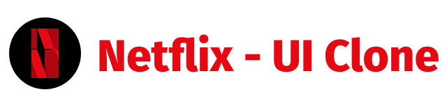
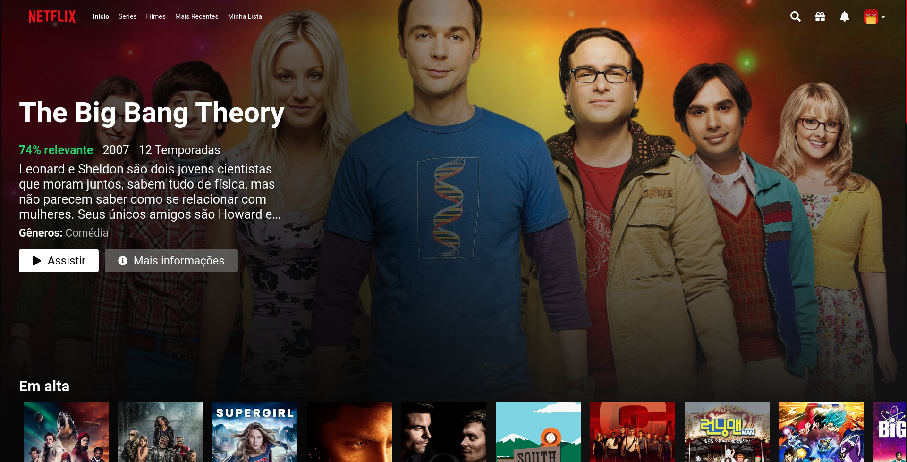

<p align="center">
  
</p>

<h3 align = "center" fontSize="60px">
  Clone da plataforma de streaming <a href="https://www.netflix.com/">Netflix</a>
</h3>

<p align="center">
  
</p>

<p align="center">
  
</p>

## :rocket: Tecnologias

-  [React.js](https://pt-br.reactjs.org/)
-  [TypeScript](https://www.typescriptlang.org/)
-  [React-icons](https://react-icons.netlify.com/)
-  [Styled-Components](https://styled-components.com/)
-  [Axios](https://github.com/axios/axios)

## 💻 Sobre o projeto

Recriar a interface do [Netflix](https://www.netflix.com/) como forma de aprendizagem e treinar as skills perante o uso de TypeScript, React e CSS. Durante a construção deste projeto foi usado este [vídeo](https://www.youtube.com/watch?v=tBweoUiMsDg&ab_channel=BoniekyLacerda) como material de apoio.

Todos os dados dos catálogos como título, descrição, capa, foto de background e avaliação foram extraídos ao usar a [API TMDb](https://www.themoviedb.org/documentation/api).

### Funcionalidades

- [x] **Spinning Loading**: Efeito ao trazer os dados da API.

- [x] **Catálogo Destaque**: Selecionar um catálogo de forma aleatória e apresentá-lo na página inicial.

- [x] **Listagem Sessões**: Ao consumir a API separar os catálogos em sessões.

- [x] **Efeito Menu**: Criar um efeito no background do menu conforme o scroll da tela do usuário.

- [x] **Cartão Catálogo**: Apresentar um cartão com os detalhes do catálogo ao passar o mouse por cima da capa.

- [x] **Listagem Carrossel**: Apresentar botões de controle para manipular a visualização dos itens da sessão.

- [ ] **Listagem Infinita**: Ao chegar no final da lista dos catálogos deve-se apresentar os mesmos itens do início.


## 📥 Instalação e execução

Faça um clone desse repositório e acesse o diretório.

```bash
$ git clone git@github.com:LeeonardoVargas/netflix-clone.git && cd netflix-clone
```

Para ter acesso a API você precisará de uma chave, basta criar uma conta no TMDB para ter acesso, [link do cadastro](https://www.themoviedb.org/signup). Caminho da chave: **Perfil -> Configurações -> API -> Chave da API**

Renomeie o arquivo `.env.example` para `.env` e cole o valor da sua chave no campo **REACT_APP_API_KEY**. Agora instale as dependências e execute o projeto:

```bash
# Instalando as dependências
$ yarn

# Executanto aplicação
$ yarn start
```

## :muscle: Contribuir

Faça o `fork` e clone o projeto a partir do seu usuário.

```bash
# Clonando projeto
$ git clone https://github.com/SEU-NOME-DE-USUARIO/netflix-clone.git

# Criando um branch
$ git branch minha-alteracao

# Acessando o novo branch
$ git checkout -b minha-alteracao

# Adicionando os arquivos alterados
$ git add .

# Criando commit e a mensagem
$ git commit -m "Corrigindo...."

# Enviando alterações para o brach
$ git push origin minha-alteracao
```
Você deve navegar até o seu repositório onde fez o fork e clicar no botão *New pull request* no lado esquerdo da página.

## 📝 Licença

Esse projeto está sob a licença MIT. Veja o arquivo [LICENSE](LICENSE.md) para mais detalhes.
